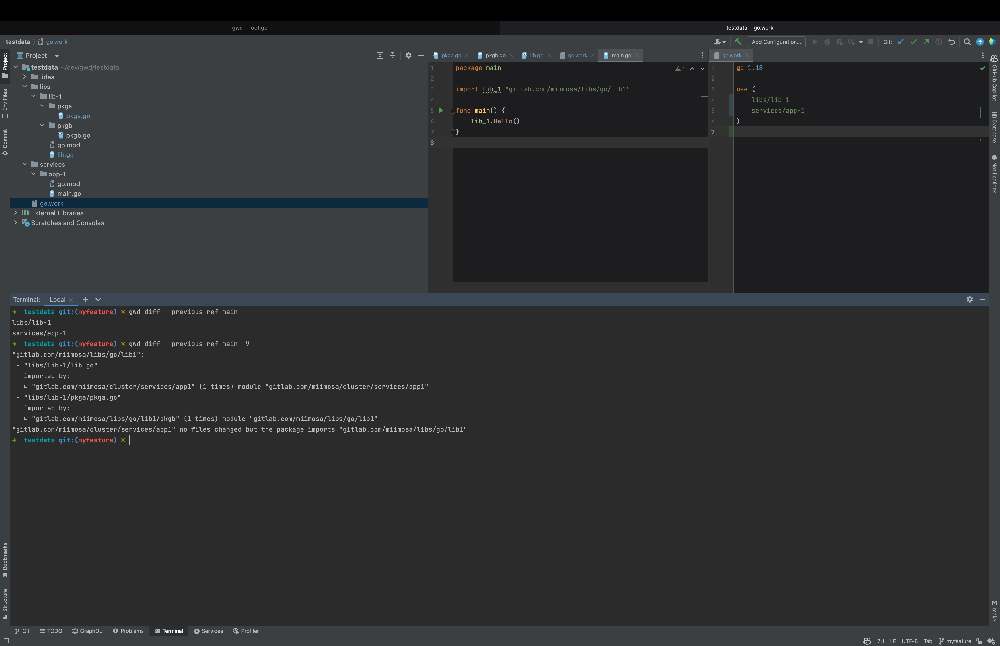
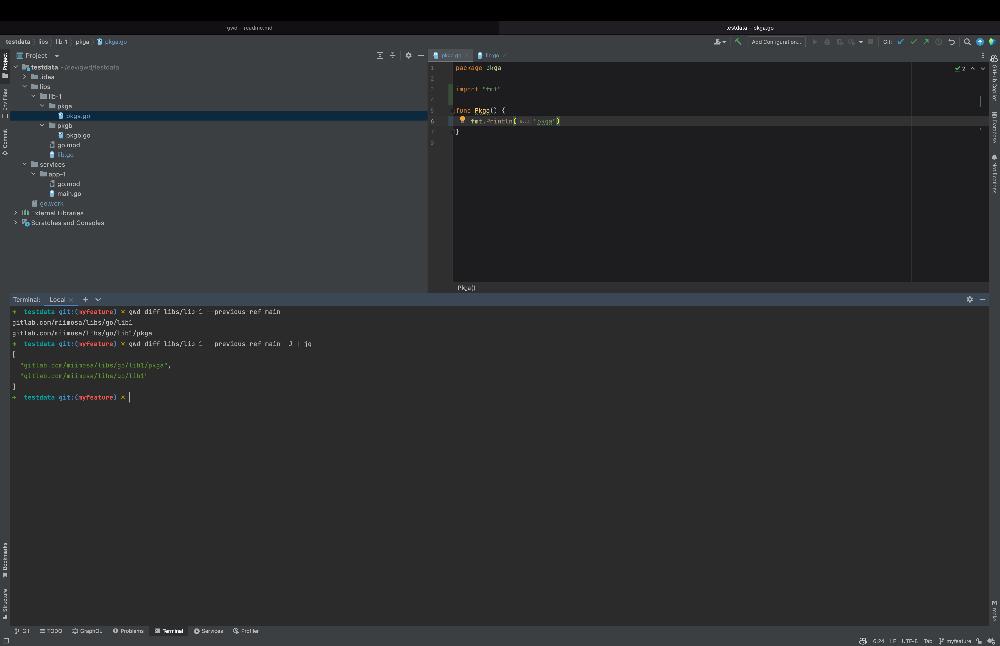
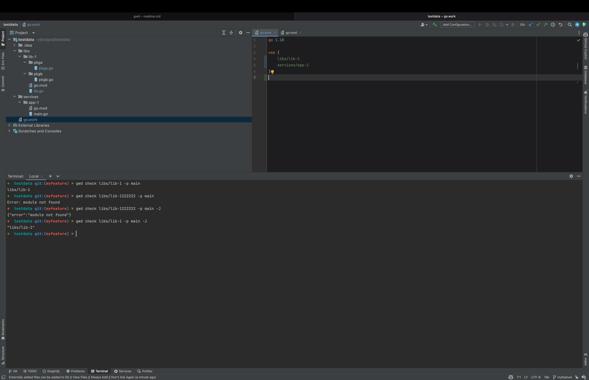

### What is this tool for ?

gwd for go workspace diff

**This is tool must be used with a go workspace file (go.work) introduced in the 1.18 release of go.**

It allows you to easily track :
- when a module change
- when packages of a module change and packages that import them

As an example, suppose a change is committed which modifies a package, libs/hypervisor. 
Suppose this package is imported by another package, services/controller.
gwd is used to inspect the git history and determine that both of these packages must be tested, although only the first package was changed.

If you think you've already read that, it's true. This excerpt comes from the blog of digitalocean in which they talk about [the organization of their monorepository](https://blog.digitalocean.com/cthulhu-organizing-go-code-in-a-scalable-repo/).

### Commands

Do `gwd --help` to see the list of commands and their usage.

#### diff 

This command is used to determine which modules, packages and package that import these packages changed between a reference and an other reference.

This command can take one argument, if it is specified it will show only diff for packages in the module specified.

#### check

This command is used to check if a module from the go workspace has change.
This command takes one argument, the name of the module, it can be a path or a module name.

### Flags 
Each of theses commands have in common 2 flags:

- `--previous-ref or -p` which is the old reference it can be a branch, tag or commit hash. 
- `--current-ref or -c` which is the current reference it can be a branch, tag or commit hash. 

#### Global flags

- `--json or -J` output commands as json
- `--verbose or -V` output commands with more details that the default output
- `--go-work-file-name or -W` set the go workspace file name which is by default parsed from the the go.mod file

 
#### Why using a pkg folder ?

I don't use internal for open source because maybe you will use some packages for your usage.
